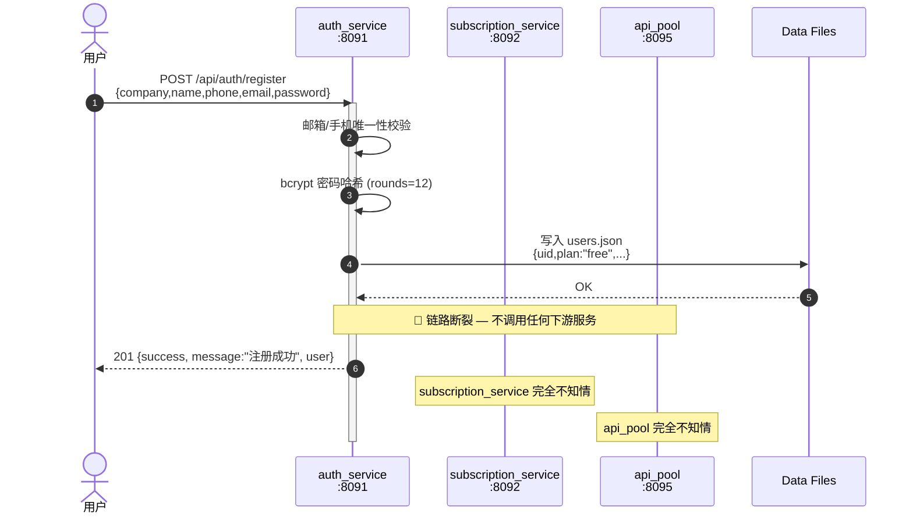
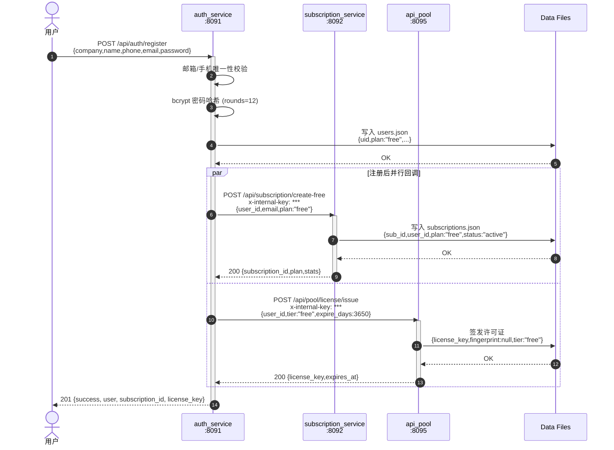
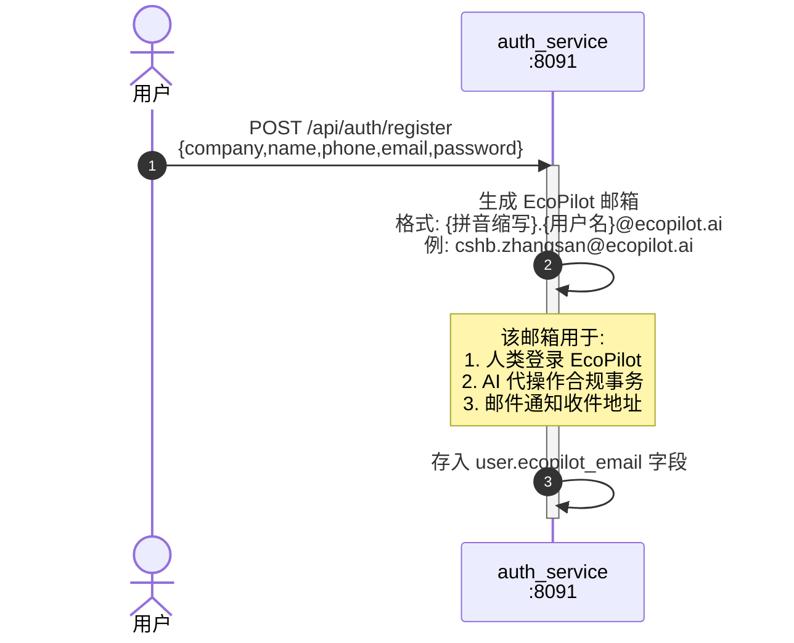

# EcoPilot 注册回调链路时序图

## 1. 当前状态（断裂的链路）

## 2. 目标状态（闭合的回调链路）

## 3. 共享邮箱生成（可选增强）

## 关键设计决策

| 项目 | 决策 |
|------|------|
| 回调方式 | HTTP POST + `x-internal-key` 鉴权 |
| 失败处理 | 写日志但不阻塞注册（最终一致性） |
| 重试机制 | 异步重试队列（后续迭代） |
| 共享邮箱 | `{拼音缩写}.{用户名}@ecopilot.ai`，注册后自动生成 |
| 回调顺序 | subscription → license（可并行） |
